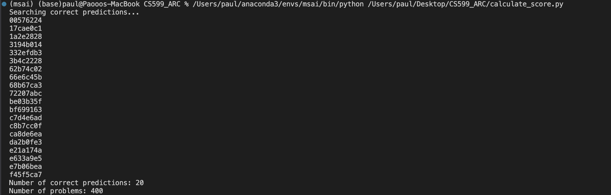

# Large Language Models for the Abstraction and Reasoning Challenge 

We explored the possibility of applying LLMs directly to the ARC challenge. 

## Code Structure

Run different Python files to invoke corresponding modules. For example, to visualize the results (including training input-output pairs, input grid, model output, and ground truth), run 
```
python -m streamlit run visualizer.py
```

## Performance


